# Hi, I'm Ari!

I'm an ECE student at Georgia Tech who likes to build things that really shouldn't work. Working at the intersection of hardware and software is my passion, I aspire to create valuable and magical user experiences that make cutting edge technology accessable to everyone.

**Computer Vision & ML** | **Hardware Design** | **Robotics & Autonomous Systems** | **Drones/UAVs** | **Rapid Prototyping**

---

*"To ask the right question is harder than to answer it." — George Cantor*

